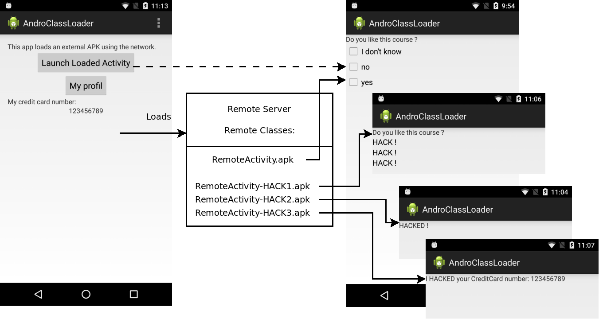

# CLASS lab - Vulnerable Class Loader


As a member of a blue team of a company, you are contacted by people in charge of the customers: they inform you that the Android application has been hacked by an attacker. Thus, you have to investigate how the attack is performed.

You contact the developer of the application, that sends you back a zip of the source code of the Android Studio project's application. This application loads some external classes from a server and you suspect that this external server for being compromised.

## Prerequisite

For this exercise, you can use an Android emulator or a
smartphone. 

### Required tools

- [JadX](https://github.com/skylot/jadx): reversing the loaded apk files

## Introduction

The image below describe the different cases, with or without an attack. 

In the normal case, the main activity loads the file RemoteActivity.apk: when hitting the button, a second activity is displayed with a question and three radio buttons.

If the file RemoteActivity is compromised, three attacks can occur:

- Attack 1 (simulated by the file RemoteActivity-HACK1.apk): three "HACK !" are displayed
- Attack 2 (simulated by the file RemoteActivity-HACK2.apk): one "HACKED" are displayed
- Attack 3  (simulated by the file RemoteActivity-HACK3.apk): your credit card number is displayed, representing that the attacker has captured this information and may be able to send it to a remote server.



## Let's go !

### Step 1 - Observe the attacks

Get the AndroClassLoader.zip file and unzip it in your Android Studio projects. Load the project in Android Studio.

Observe the normal behavior of the application. This is simulated by chosing the apk file RemoteActivity-ORIGIN.apk:

```
private static final String SECONDARY_DEX_NAME = "RemoteActivity-ORIGIN.apk";
```

Observe the first attack. To do this, simulate the attack by changing the loaded apk file to RemoteActivity-HACK1.apk. Comment the original line and uncomment:

```
private static final String SECONDARY_DEX_NAME = "RemoteActivity-HACK1.apk";
```

You can observe the two other attacks by uncommenting one of the other lines (and commenting others):

```
private static final String SECONDARY_DEX_NAME = "RemoteActivity-HACK2.apk";
//private static final String SECONDARY_DEX_NAME = "RemoteActivity-HACK3.apk";
```

You are now ready to investigate.

### Step 2 - Investigate the attacks

Using Jadx, reverse the different hacked apks (RemoteActivity-HACKx.apk).

### Step 3 - Write countermeasures

Modify the source code of the application for:

- attack 1: attack 1 should be defeated and the original activity should be restored
- attack 2: no countermeasures can be easily implemented for this attack. Why ?
- attack 3: the credit card number should not be captured by the second activity but should still be usable by the first activity.
- 
## Solutions

**DO NOT READ THE SOLUTIONS BEFORE INVESTIGATING, otherwise the exercises become too easy... :p**

### Attack 1

When observing the logs you see:

```
andro.jf.androclassloader I/JFL: Connecting to https://gitlab.inria.fr/jlalande/teaching-android-mobile-security/raw/master/CLASS/RemoteActivity-HACK1.apk
andro.jf.androclassloader I/JFL: CustomClassLoader: Loading class andro.jf.appli.RandomActivity
andro.jf.androclassloader I/JFL: CustomClassLoader: Loading class android.app.Activity
andro.jf.androclassloader I/JFL: Cannot load: asking to my father android.app.Activity
andro.jf.androclassloader I/JFL: returning class andro.jf.appli.RandomActivity
andro.jf.androclassloader I/JFL: andro.jf.appli.RandomActivityloaded !

```

When investigating the available classes of the Android Studio project, you should understand that the RandomActivity comes from the external apk (RemoteActivity-HACK1.apk). Then, by reversing this external apk, you see:

- **RandomActivity** that just create an activity using the layout *Test*.
- **Test** that creates the questions and the three checkboxes.

At this point, all is going fine, but when launching the second activity the logs show:

```
andro.jf.androclassloader I/JFL: CustomClassLoader: Loading class android.view.View
andro.jf.androclassloader I/JFL: Cannot load: asking to my father android.view.View
andro.jf.androclassloader I/JFL: CustomClassLoader: Loading class android.widget.CheckBox
```

And you should be surprised that the class loader loads *CheckBox*, which is obviously a class from Android, and not a class that is supposed to be loaded from an external resource. By investigating the external apk (RemoteActivity-HACK1.apk) you find in the package *android.widget* the class *CheckBox* that contains the attack:

```
 public void setText(CharSequence text, BufferType type) {
        super.setText("HACK !", type);
    }
```

Thus, in this situation, two definitions of *CheckBox* are possible: the one of the system, and the one of the external apk. The custom class loader has loaded the wrong one and this is the vulnerability you should have discovered. A correct implementation should **always** ask to the system first, before loading a class from an external resource. When using a hierarchy of class loader, a good implementation of one of the class loader of the hierarchy should ask first to the father, and then try to load the class itself.

Changing the loading order in *loadClass(String className)* of the class *CustomClassLoader*, fixes attack 1.

### Attack 2

The second attack comes from a reimplemention of the constructor of the class *Test*. In the original implementation, no constructor is given, thus the default one of *LinearLayout* is used. If the attacker changes the constructor, then the original code is lost and nothing can be done against it.

For this attack no easy countermeasures can be written. The developer should check the integrity of the loaded apk, for example by verifying its signature.

### Attack 3

The third attack shows a TextView saying that the credit card number have been "hacked". In real life, the attacker could have uploaded the credit card number to a remote server. Reversing the external apk file (RemoteActivity-HACK3.apk) shows, in the *Test* class:

```
textView.setText("I HACKED your CreditCard number: " + 
((Integer) Class.forName("andro.jf.androclassloader.CreditCard")
                .getDeclaredMethod("getNumber", new Class[0])
                .invoke(Class.forName("andro.jf.androclassloader.Profil")
                .getDeclaredMethod("getCreditCard", new Class[0])
                .invoke(Class.forName("andro.jf.androclassloader.MainActivity")
                .getField("myProfileForReadOnlyPurpose")
                .get(null), new Object[0]), new Object[0]))
                .intValue());
addView(textView);
```

This code works by inspecting and invoking the methods of the classes used in the first activity. The problems comes from the field "myProfileForReadOnlyPurpose" that can be obtained in the class *MainActivity*. Because of the *static* modifier of this field, the second activity can get this field (it would not be possible if this field have been put not static). Thus, by getting the *Profil* object, the *CreditCard* object can be accessed.

This implementation is a vulnerable one, because the profil object stays in memory because of the *static* field. For better security, these objects should be unloaded from the memory (at least, can be garbage collectetd) in order to avoid to be stolen by a malicious code.

## Conclusion

These exercises show that a dirty implementation can help an attacker to build some attacks. Of course, the hypothesis is that the external apk file is compromised, but the vulnerabilities of the code (a broken class loader and unnecessary static field) helps the attacker to perform attacks. Even if the developer fixes these vulerabilities, an attacker that can inject code in the external apk files would be able to perform attacks. There is no easy way of securing an application when a payload is executed inside the application. At least, we can try to make the payload more difficult to write.
